# Speech Enhancement with Fullband-Subband Cross-Attention Network

### *Jun Chen, Wei Rao, Zilin Wang, Zhiyong Wu, Yannan Wang,  Tao Yu, Shidong Shang, Helen Meng*

<h2 id = "1">Abstract</h2>

FullSubNet has shown its promising performance on speech enhancement by utilizing both fullband and subband information. However, the relationship between fullband and subband in FullSubNet is achieved by simply concatenating the output of fullband model and subband units. It has not considered the interaction between fullband and subband. This paper proposes a fullband-subband cross-attention (FSCA) module to interactively fuse the global and local spectral information and applies it to FullSubNet. This new framework is called as FS-CANet. Moreover, different from FullSubNet, the proposed FS-CANet optimize the fullband extractor by temporal convolutional network (TCN) blocks to further reduce the model size. Experimental results on DNS Challenge - Interspeech 2021 dataset show that the proposed FS-CANet outperforms other state-of-the-art speech enhancement approaches, and demonstrate the effectiveness of fullband-subband cross-attention.

## With Reverberation

<h3 id = "8">case 1</h3>

|                          **case 1**                          |                                                              |
| :----------------------------------------------------------: | :----------------------------------------------------------: |
| **Noisy** <audio controls><source src="./data/with_reverb/example63/noisy.wav" type="audio/wav">Your browser does not support the audio element.</audio> | **FullSubNet** <audio controls><source src="./data/with_reverb/example63/fullsubnet.wav" type="audio/wav">Your browser does not support the audio element.</audio> |
| **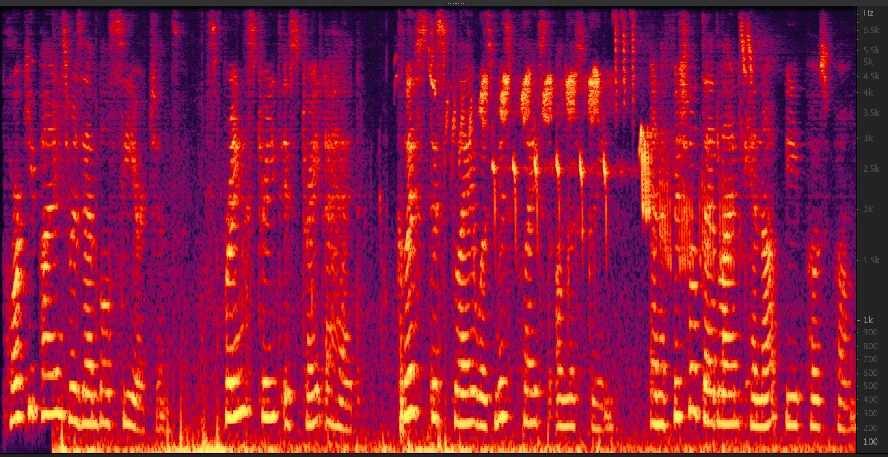** | **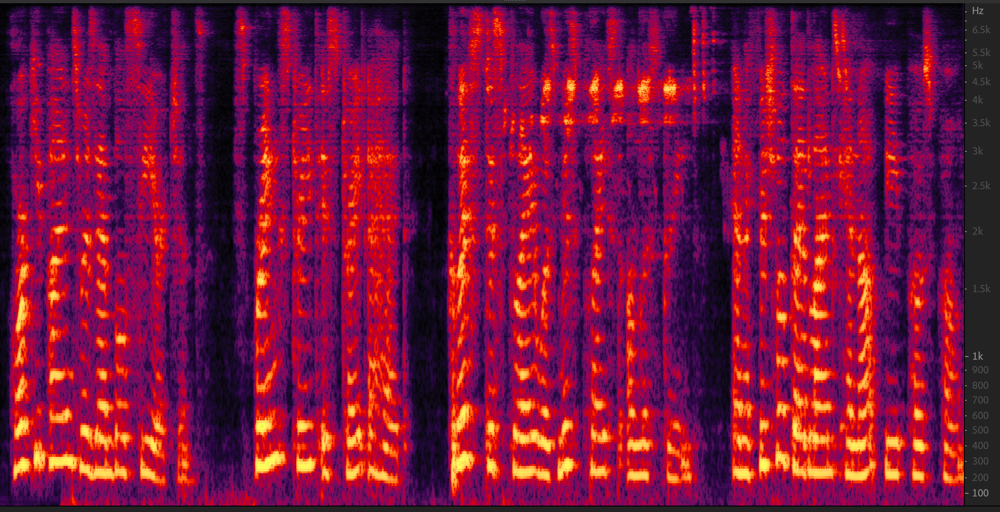** |
| **FS-CANet** <audio controls><source src="./data/with_reverb/example63/fscanet.wav" type="audio/wav">Your browser does not support the audio element.</audio> | **Clean** <audio controls><source src="./data/with_reverb/example63/clean.wav" type="audio/wav">Your browser does not support the audio element.</audio> |
| 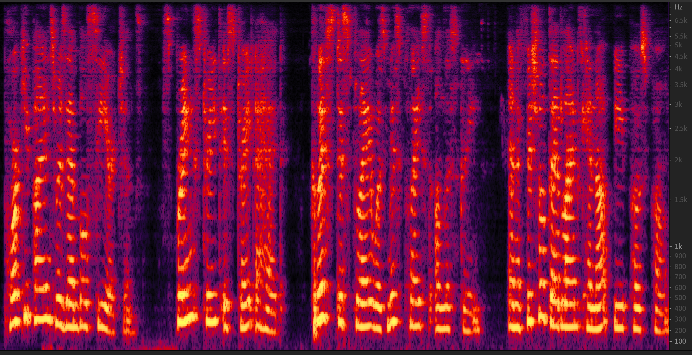 | 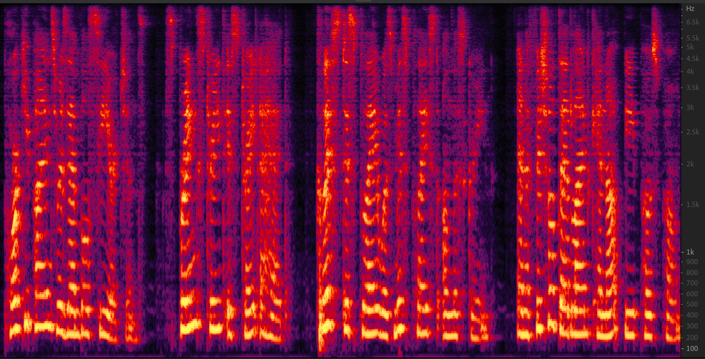 |

<h3 id = "8">case 2</h3>

|                          **case 2**                          |                                                              |
| :----------------------------------------------------------: | :----------------------------------------------------------: |
| **Noisy** <audio controls><source src="./data/with_reverb/example249/noisy.wav" type="audio/wav">Your browser does not support the audio element.</audio> | **FullSubNet** <audio controls><source src="./data/with_reverb/example249/fullsubnet.wav" type="audio/wav">Your browser does not support the audio element.</audio> |
| **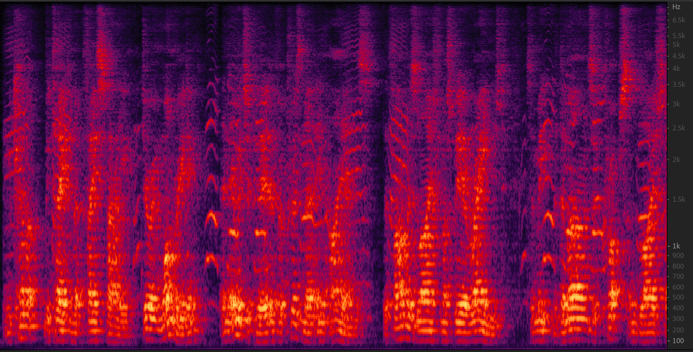** | **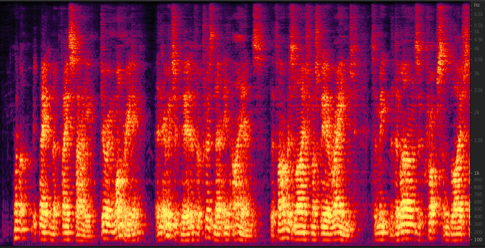** |
| **FS-CANet** <audio controls><source src="./data/with_reverb/example249/fscanet.wav" type="audio/wav">Your browser does not support the audio element.</audio> | **Clean** <audio controls><source src="./data/with_reverb/example249/clean.wav" type="audio/wav">Your browser does not support the audio element.</audio> |
| 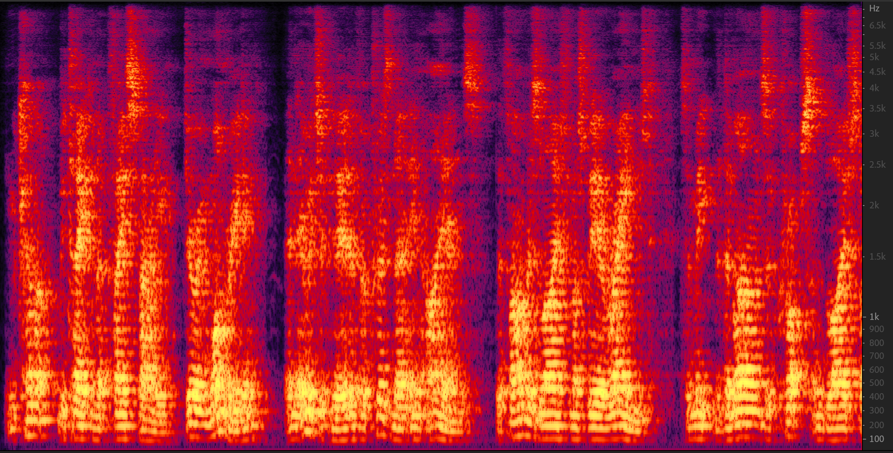 | 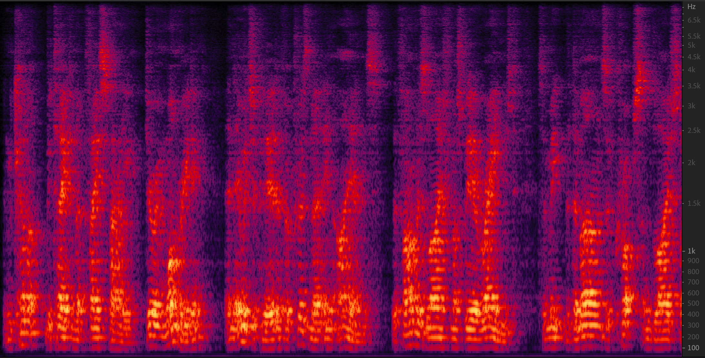 |

<h3 id = "8">case 3</h3>

|                          **case 3**                          |                                                              |
| :----------------------------------------------------------: | :----------------------------------------------------------: |
| **Noisy** <audio controls><source src="./data/with_reverb/example206/noisy.wav" type="audio/wav">Your browser does not support the audio element.</audio> | **FullSubNet** <audio controls><source src="./data/with_reverb/example206/fullsubnet.wav" type="audio/wav">Your browser does not support the audio element.</audio> |
| **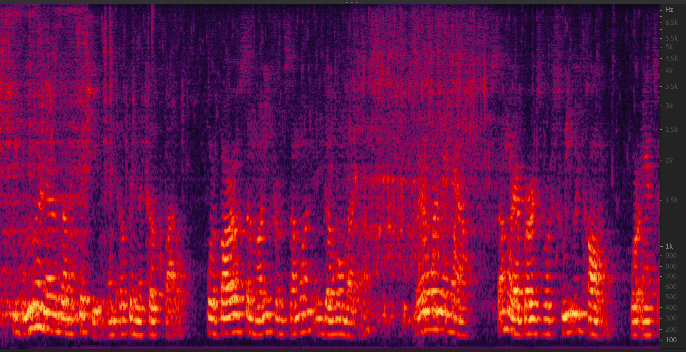** | **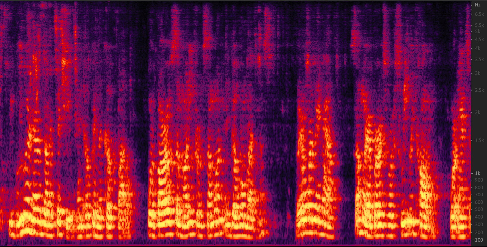** |
| **FS-CANet** <audio controls><source src="./data/with_reverb/example206/fscanet.wav" type="audio/wav">Your browser does not support the audio element.</audio> | **Clean** <audio controls><source src="./data/with_reverb/example206/clean.wav" type="audio/wav">Your browser does not support the audio element.</audio> |
| 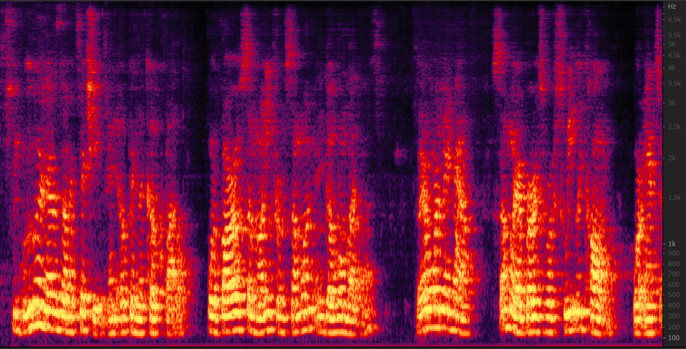 | 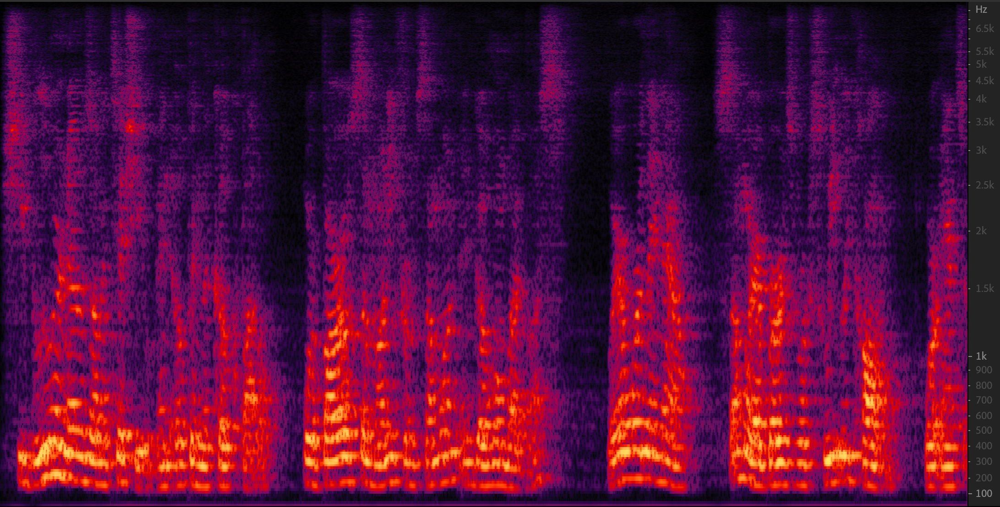 |

<h3 id = "8">case 4</h3>

|                          **case 4**                          |                                                              |
| :----------------------------------------------------------: | :----------------------------------------------------------: |
| **Noisy** <audio controls><source src="./data/with_reverb/example26/noisy.wav" type="audio/wav">Your browser does not support the audio element.</audio> | **FullSubNet** <audio controls><source src="./data/with_reverb/example26/fullsubnet.wav" type="audio/wav">Your browser does not support the audio element.</audio> |
| **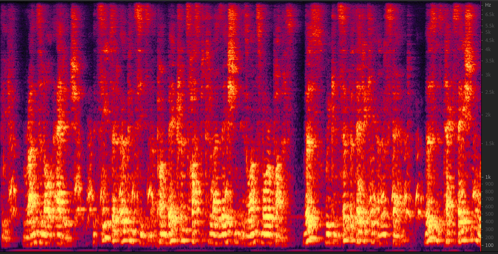** | **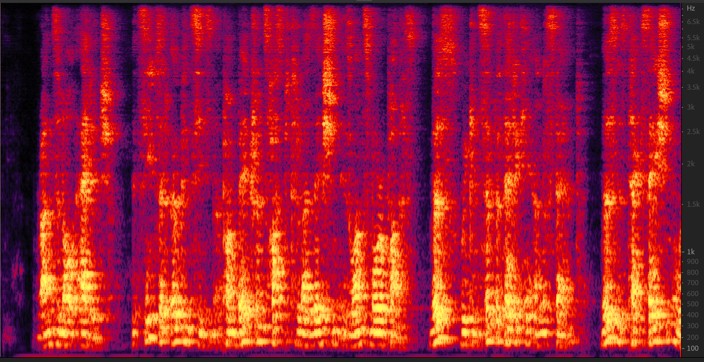** |
| **FS-CANet** <audio controls><source src="./data/with_reverb/example26/fscanet.wav" type="audio/wav">Your browser does not support the audio element.</audio> | **Clean** <audio controls><source src="./data/with_reverb/example26/clean.wav" type="audio/wav">Your browser does not support the audio element.</audio> |
| 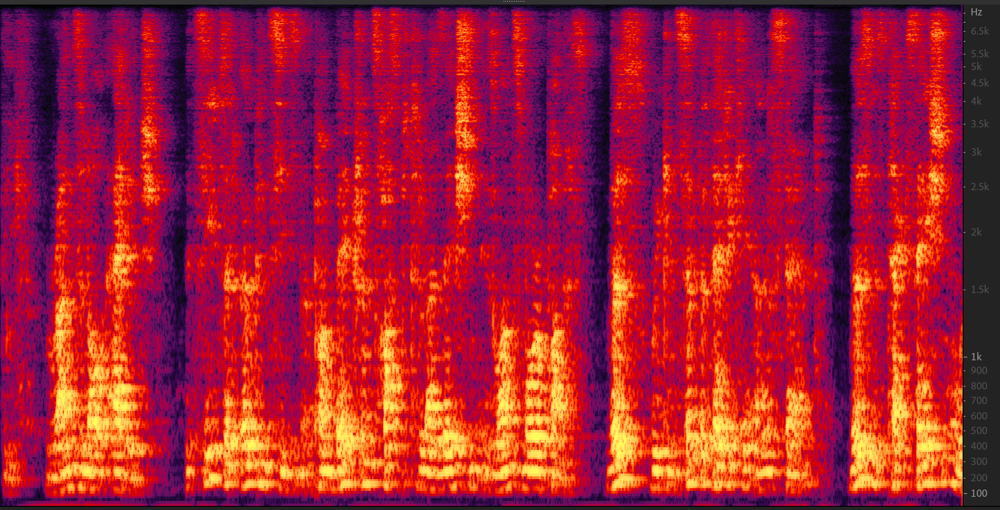 | 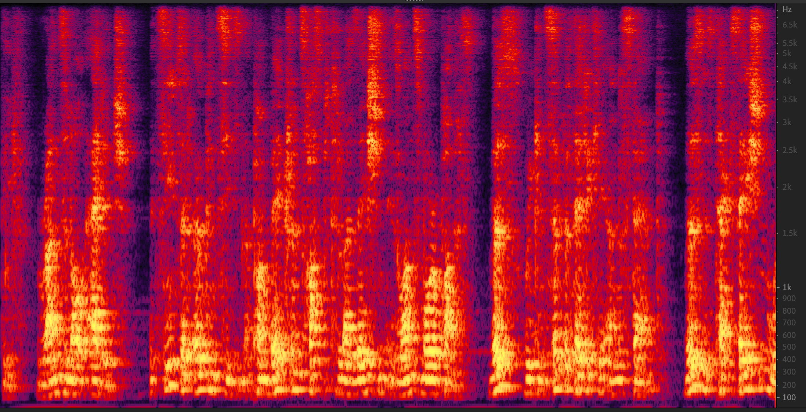 |

## Without Reverberation

<h3 id = "3"> case 1</h3>

|                          **case 1**                          |                                                              |
| :----------------------------------------------------------: | :----------------------------------------------------------: |
| **Noisy** <audio controls><source src="./data/no_reverb/example63/noisy.wav" type="audio/wav">Your browser does not support the audio element.</audio> | **FullSubNet** <audio controls><source src="./data/no_reverb/example63/fullsubnet.wav" type="audio/wav">Your browser does not support the audio element.</audio> |
| **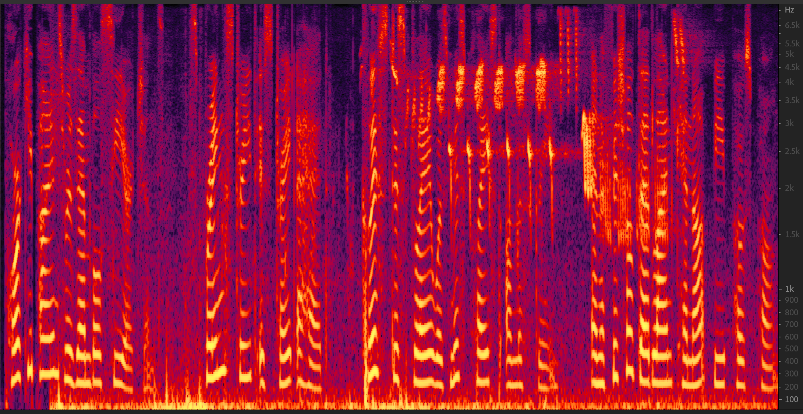** | 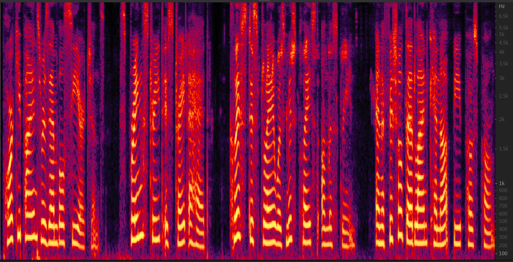 |
| **FS-CANet** <audio controls><source src="./data/no_reverb/example63/fscanet.wav" type="audio/wav">Your browser does not support the audio element.</audio> | **Clean** <audio controls><source src="./data/no_reverb/example63/clean.wav" type="audio/wav">Your browser does not support the audio element.</audio> |
| 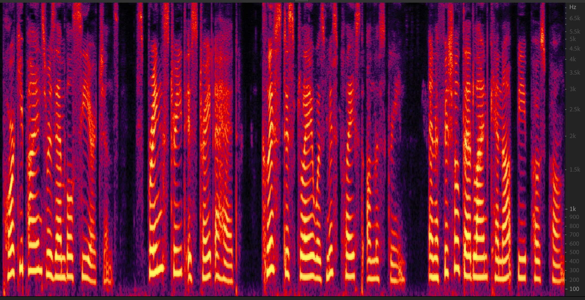 | 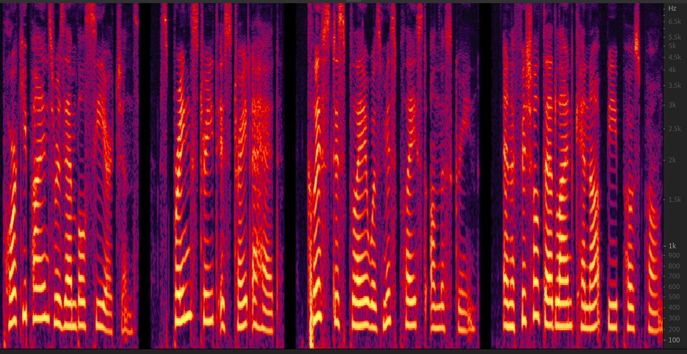 |

<h3 id = "3"> case 2</h3>

|                          **case 2**                          |                                                              |
| :----------------------------------------------------------: | :----------------------------------------------------------: |
| **Noisy** <audio controls><source src="./data/no_reverb/example67/noisy.wav" type="audio/wav">Your browser does not support the audio element.</audio> | **FullSubNet** <audio controls><source src="./data/no_reverb/example67/fullsubnet.wav" type="audio/wav">Your browser does not support the audio element.</audio> |
| **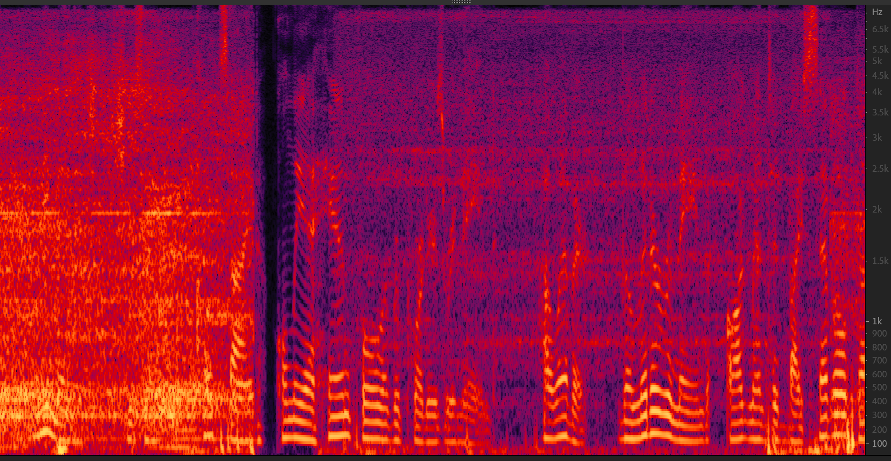** | 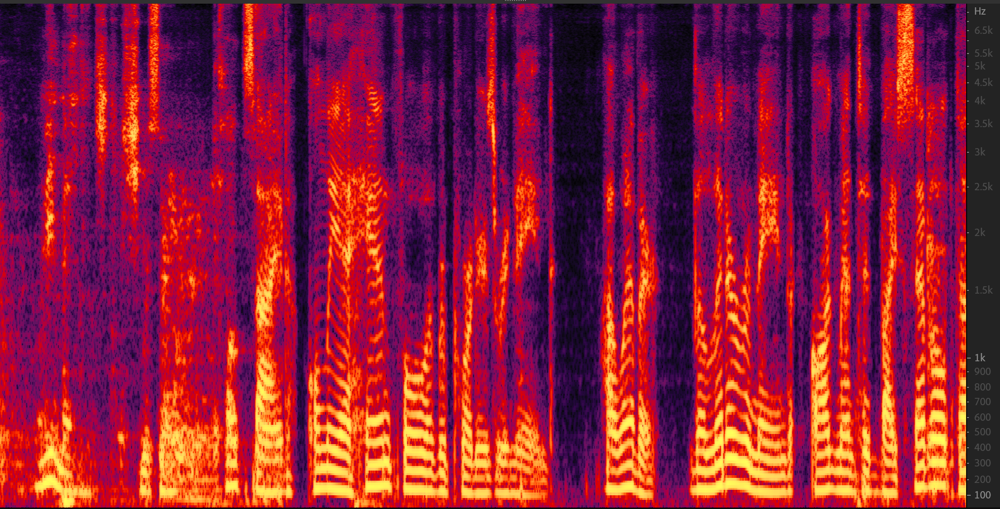 |
| **FS-CANet** <audio controls><source src="./data/no_reverb/example67/fscanet.wav" type="audio/wav">Your browser does not support the audio element.</audio> | **Clean** <audio controls><source src="./data/no_reverb/example67/clean.wav" type="audio/wav">Your browser does not support the audio element.</audio> |
| 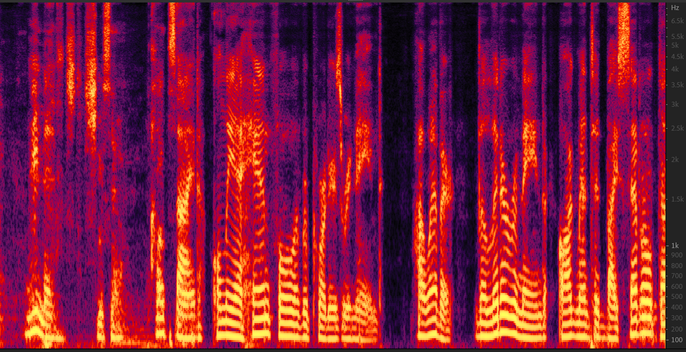 | 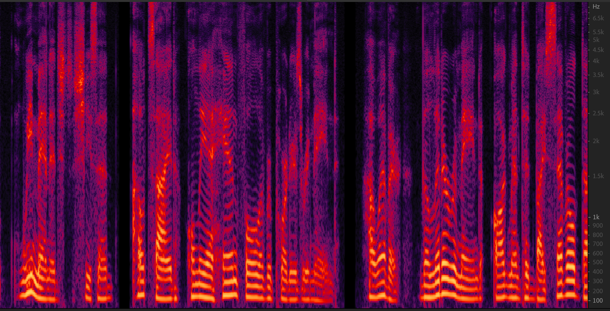 |

<h3 id = "3"> case 3</h3>

|                          **case 3**                          |                                                              |
| :----------------------------------------------------------: | :----------------------------------------------------------: |
| **Noisy** <audio controls><source src="./data/no_reverb/example145/noisy.wav" type="audio/wav">Your browser does not support the audio element.</audio> | **FullSubNet** <audio controls><source src="./data/no_reverb/example145/fullsubnet.wav" type="audio/wav">Your browser does not support the audio element.</audio> |
| **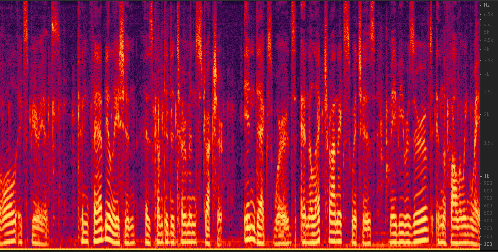** | 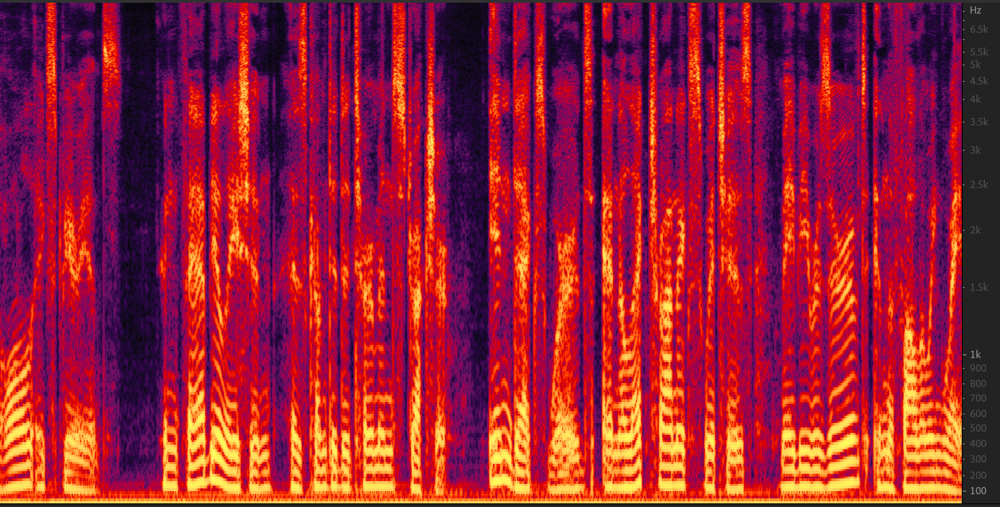 |
| **FS-CANet** <audio controls><source src="./data/no_reverb/example145/fscanet.wav" type="audio/wav">Your browser does not support the audio element.</audio> | **Clean** <audio controls><source src="./data/no_reverb/example145/clean.wav" type="audio/wav">Your browser does not support the audio element.</audio> |
| 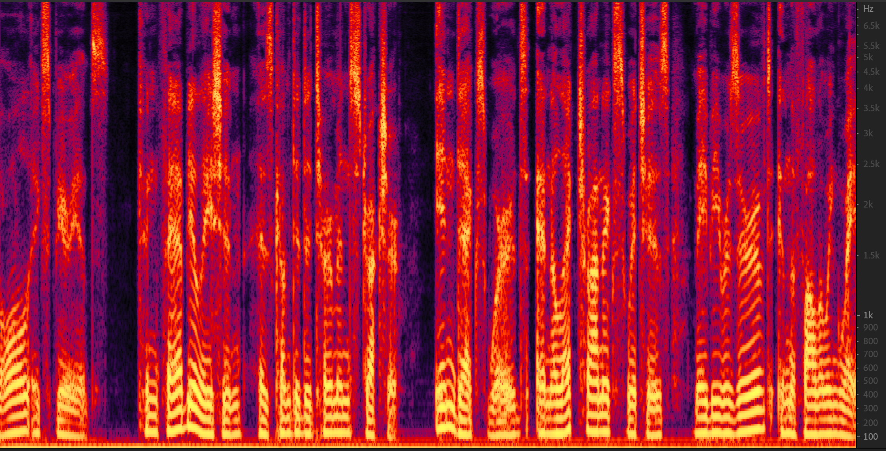 | 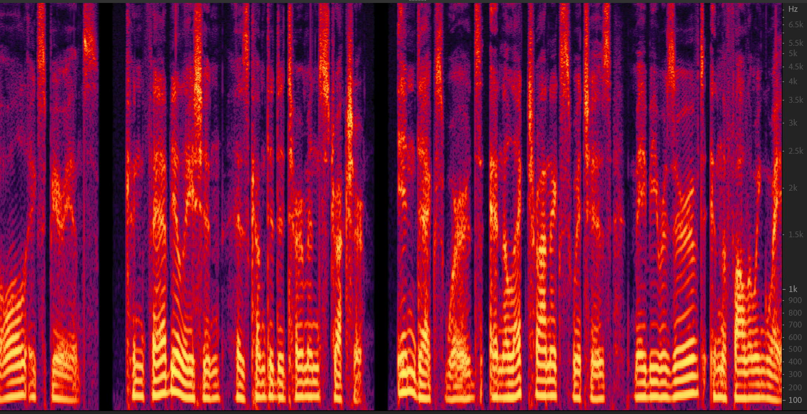 |

<h3 id = "3"> case 4</h3>

|                          **case 4**                          |                                                              |
| :----------------------------------------------------------: | :----------------------------------------------------------: |
| **Noisy** <audio controls><source src="./data/no_reverb/example206/noisy.wav" type="audio/wav">Your browser does not support the audio element.</audio> | **FullSubNet** <audio controls><source src="./data/no_reverb/example206/fullsubnet.wav" type="audio/wav">Your browser does not support the audio element.</audio> |
| **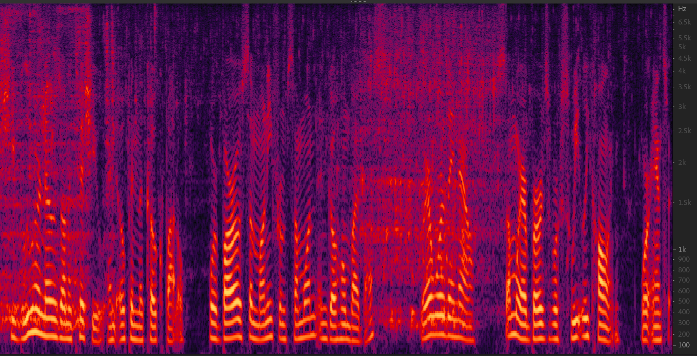** | 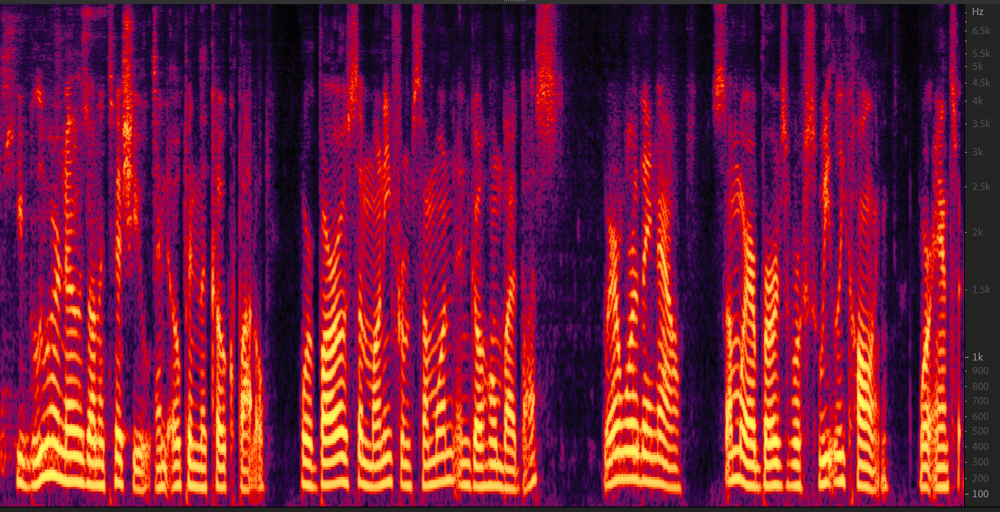 |
| **FS-CANet** <audio controls><source src="./data/no_reverb/example206/fscanet.wav" type="audio/wav">Your browser does not support the audio element.</audio> | **FS-CANet** <audio controls><source src="./data/no_reverb/example206/clean.wav" type="audio/wav">Your browser does not support the audio element.</audio> |
| 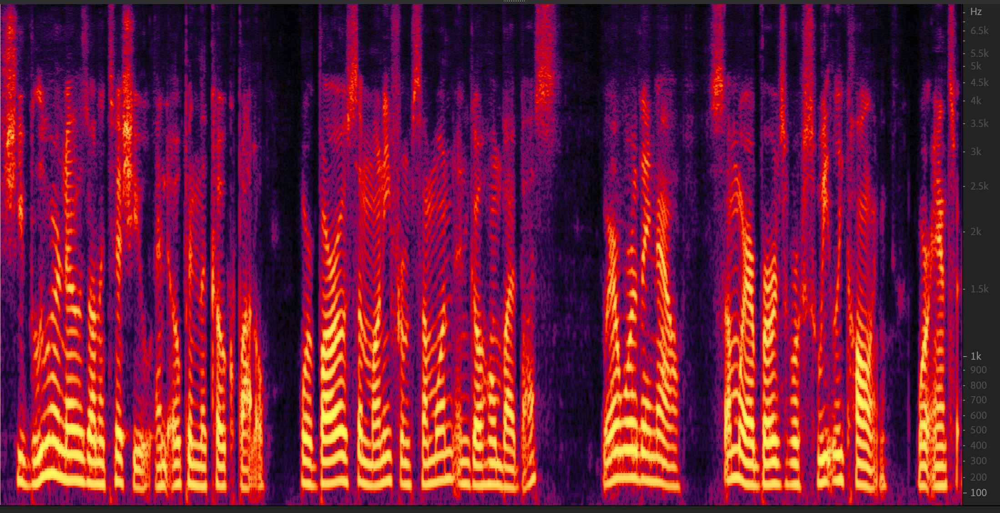 | 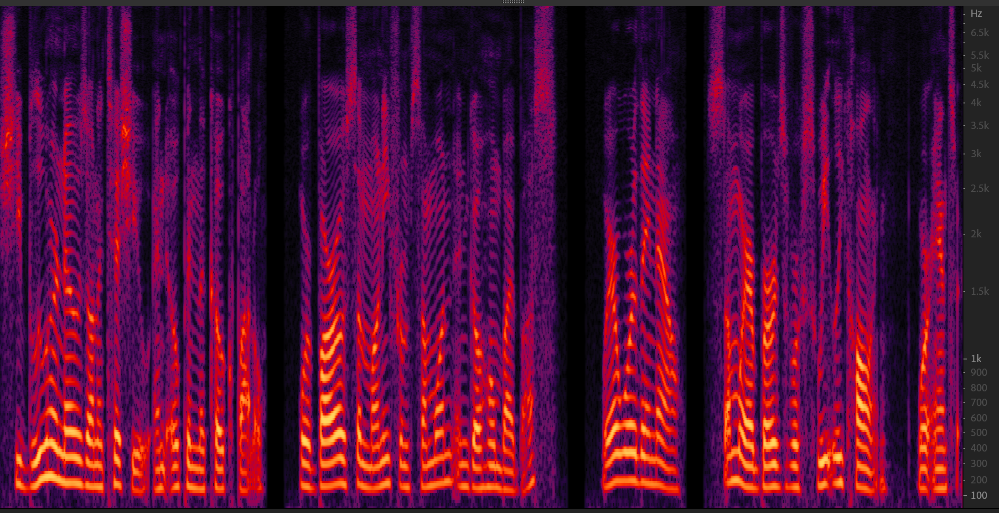 |
